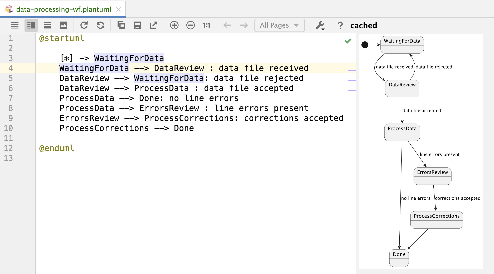
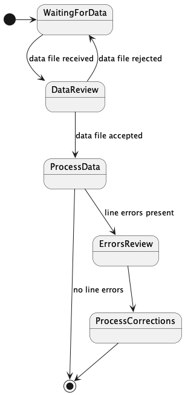

Workflow Visualization Demo
----

## 1. Introduction

### Prerequisites

 
* A computer with OS X or Linux (Windows can be used, but more painful)
* Java 21
* Maven (sdk install maven)
* tctl (brew install tctl)
* python3 (brew install python3)
* docker

## 2. Workflow Implementation

### 2.1 Workflow Diagram

We can start from defining the workflow in planUML syntax, and visualize it with
using excellent IntelliJ plugin for PlantUML.



As we can see, the workflow is defined in a very abstract way, and we can have a good
visualization of workflow.



### 2.1. Workflow Definition

The workflow is a Final State Machine (FSM), and we can define it in with using a domain
specific language or a library. In this example we use kstatemachine library https://github.com/nsk90/kstatemachine.

```kotlin
 val fsmDefinition = stateMachine(
            DataProcessingStates.entries.toSet(),
            DataProcessingEvents.entries.toSet(),
            DataProcessingContext::class,
            DataProcessingParameters::class
        ){
            defaultInitialState = WaitingForData
            whenState( WaitingForData) {
                onEvent(DataReceived to DataProcessingStates.DataReview) {
                    fetchData( it as FilePointer)
                }
            }

            whenState( DataReview) {
                onEvent(DataApproved to ProcessData) {
                    processData()
                }

                onEvent(DataRejected to WaitingForData) {
                    requestCorrectedData()
                }
            }

            whenState( ProcessData) {
                onEvent(DataProcessed to Done) {

                }
                onEvent( ErrorsFound to ErrorsReview) {
                   notifyReviewers()
                }
            }

            whenState( ErrorsReview) {
                onEvent(CorrectionsAccepted to ProcessCorrections) {
                    processCorrections()
                }
            }

            whenState( ProcessCorrections) {
                onEvent(CorrectionsProcessed to Done) {

                }
            }

        }.build()
```

Thanks to the kstatemachine library our workflow definition is as readable as our
abstract definition, but we benefit from the type safety and IDE support - the definition
is in Kotlin language, and we can use all the power of Kotlin and IDE to
simplify implementation.


**Note:** A different SDK can be used to implement Temporal workflows, or even mix of SDKs:
for example workflow can be in Python, and Activities in JavaScript.

## 3. Workflow Execution Demo

### 3.1. Run Temporal Server

In a separate terminal window run Temporal Server:

```shell
cd temporal
docker compose up
```

### 3.2. Run Workflow and Activities

Those are implemented as SpringBoot application and can be run in a separate window with:

```shell
cd <project-root>
mvn spring-boot:run
```

### 3.3. Execute Workflows and Visualize state

Open a separate terminal window at the project root

```shell
./scripts/start-wf.sh
```
This will return a workflow id, for example:

```shell
Running execution:
  WorkflowId  a23da575-3ae3-43cf-bd0d-886470f34644
  RunId       796b833d-3348-472d-93fe-0610668cac77  
  Type        DataProcessingWF                      
  Namespace   default                               
  TaskQueue   data-processing-wf                    
  Args        ["account42"] 
```  


Then we make the workflow ID available for our helper scripts:

```shell    
export WFID=a23da575-3ae3-43cf-bd0d-886470f34644
```

At this point we can see the workflow state in the Temporal Web UI by 
opening http://localhost:8080/

And we can see the workflow state and workflow definition in the console :

```shell
 ./scripts/send-query.sh getWorkflowInfo 
 ./scripts/send-query.sh getPlantUMLWorkflowDefinition
```

and we can run visualizer helper which will open a browser window with the workflow diagram:

```shell
 ./scripts/visualize-wf.sh
```

then we can send signal to advance workflow and then visualize it again:

```shell
 ./scripts/send-signal.sh dataReceived file321
 ./scripts/visualize-wf.sh
```

and now we can send another signal to advance workflow

```shell
 ./scripts/send-signal.sh dataApproved
 ./scripts/visualize-wf.sh
```
