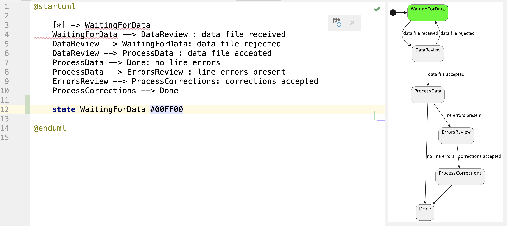
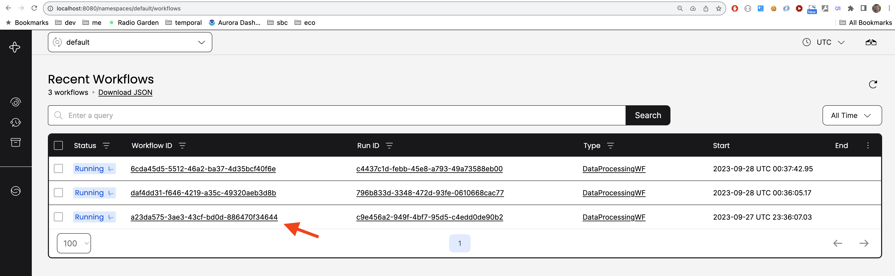
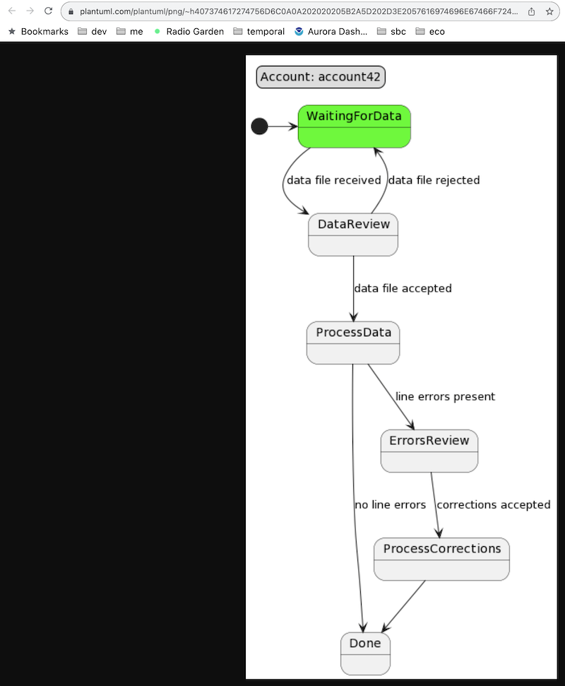
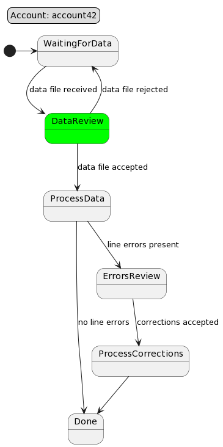
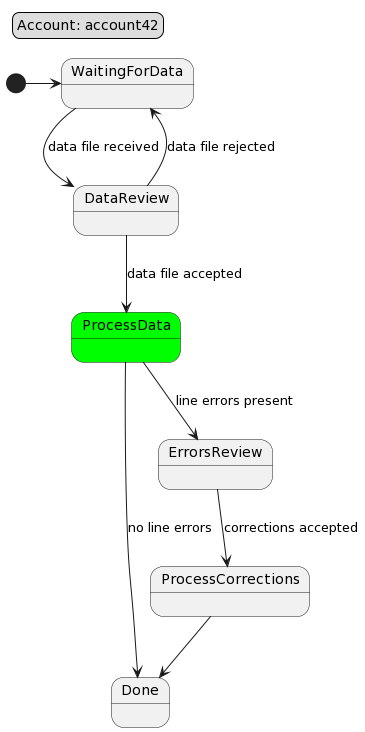

Workflow Visualization Demo
----

## 1. Introduction

Hope everyone knows about Temporal.io (https://temporal.io/) - a great workflow engine. If not,
please familiarize yourself with it and start using, you will love it, and it will save you 
millions of dollars and many months of development time.

In short, Temporal.io allows us to write workflows in programming language of our choice,
Unit test them(!!!), and then run them in a distributed environment.

The platform is very stable, reliable, fast, and secure. Developers love it but when it comes 
to 'selling' it to management and business people, it gets challenging because there is no
visual representation of the workflow runtime state as a diagram. Business people love diagrams,
and that allows con artists from low/no code platforms to sell their snake oil (Appian, Jitterbit, etc).

Well, we can do better, and this project is a demonstrates how
temporal can be enhanced to provide visual representation of workflows.


**Note:** Even this project is written with Kotlin and run on JVM platform, the same approach can be used
with any other language and platform supported by Temporal. 

### Concepts
*  Worflows provide 2 query methods: 
    * one that returns workflow definition in PlantUML format
    * and another that returns name (or names) of current active states

A helper utility can be used make those queries, enhance PlantUML definition with current state information, 
and create PlantUML server URL with encoded diagram. POC grade implementation can be found here  https://github.com/visual-workflow/visual-workflow-visualizer

*I hope that Temporal team will adopt this (or similar) approach and 
provide a built-in support for workflow visualization from their UI.*


### Prerequisites

 
* A computer with OS X or Linux (Windows can be used, but more painful)
* Java 21
* Maven (sdk install maven)
* temporal cli (brew install temporal)
* python3 (brew install python3)
* docker
* check out https://github.com/visual-workflow/visual-workflow-api next to this project
  * cd visual-workflow-api
  * mvn install
* check out visualizer project  https://github.com/visual-workflow/visual-workflow-visualizer next to this one

Now we are ready to experiment.

## 2. Workflow Implementation

### 2.1 Workflow Diagram

We can start from defining the workflow in planUML syntax, and visualize it with
using excellent IntelliJ plugin for PlantUML.


As we can see, the workflow is defined in a very abstract way, and we can have a good
visualization of workflow.


and to colorize the diagram we simply need to add lines like 'state <StateName> #<color>' to the diagram definition.
So, our helper script simply need to prepend closing tag with those lines. Then workflow diagram will look like this



### 2.1. Workflow Definition

The workflow is a Final State Machine (FSM), and we can define it in with using a domain
specific language or a library. In this example we use kstatemachine library https://github.com/nsk90/kstatemachine.

```kotlin
 val fsmDefinition = stateMachine(
            DataProcessingStates.entries.toSet(),
            DataProcessingEvents.entries.toSet(),
            DataProcessingContext::class,
            DataProcessingParameters::class
        ){
            defaultInitialState = WaitingForData
            whenState( WaitingForData) {
                onEvent(DataReceived to DataProcessingStates.DataReview) {
                    fetchData( it as FilePointer)
                }
            }

            whenState( DataReview) {
                onEvent(DataApproved to ProcessData) {
                    processData()
                }

                onEvent(DataRejected to WaitingForData) {
                    requestCorrectedData()
                }
            }

            whenState( ProcessData) {
                onEvent(DataProcessed to Done) {

                }
                onEvent( ErrorsFound to ErrorsReview) {
                   notifyReviewers()
                }
            }

            whenState( ErrorsReview) {
                onEvent(CorrectionsAccepted to ProcessCorrections) {
                    processCorrections()
                }
            }

            whenState( ProcessCorrections) {
                onEvent(CorrectionsProcessed to Done) {

                }
            }

        }.build()
```

Thanks to the kstatemachine library our workflow definition is as readable as our
abstract definition, but we benefit from the type safety and IDE support - the definition
is in Kotlin language, and we can use all the power of Kotlin and IDE to
simplify implementation.


**Note:** A different SDK can be used to implement Temporal workflows, or even mix of SDKs:
for example workflow can be in Python, and Activities in JavaScript.

## 3. Workflow Execution Demo

### 3.1. Run Temporal Server

In a separate terminal window run Temporal Server:

```shell
cd temporal
docker compose up
```

### 3.2. Run Workflow and Activities

Those are implemented as SpringBoot application and can be run in a separate terminal window with:

```shell
cd <project-root>
mvn spring-boot:run
```

### 3.3. Execute Workflows and Visualize state

Open a separate terminal window at the project root

```shell
./scripts/start-wf.sh
```
This will return a workflow id, for example:

```shell
Running execution:
  WorkflowId  a23da575-3ae3-43cf-bd0d-886470f34644
  RunId       796b833d-3348-472d-93fe-0610668cac77  
  Type        DataProcessingWF                      
  Namespace   default                               
  TaskQueue   data-processing-wf                    
  Args        ["account42"] 
```  


Then we make the workflow ID available for our helper scripts:

```shell    
export WFID=a23da575-3ae3-43cf-bd0d-886470f34644
```

At this point we can see the workflow state in the Temporal Web UI by 
opening http://localhost:8080/



And we can see the workflow state and workflow definition in the console :

```shell
 ./scripts/send-query.sh getWorkflowInfo 
Query result:
[{"legend":"Account: account42","activeStates":[{"stateName":"WaitingForData","isError":null,"comment":null}]}]

 ./scripts/send-query.sh getPlantUMLWorkflowDefinition
 
Query result:
["@startuml\n\n    [*] -> WaitingForData\n    WaitingForData --> DataReview : data file received\n    DataReview --> WaitingForData: data file rejected\n    DataReview --> ProcessData : data file accepted\n    ProcessData --> Done: no line errors\n    ProcessData --> ErrorsReview : line errors present\n    ErrorsReview --> ProcessCorrections: corrections accepted\n    ProcessCorrections --> Done\n\n@enduml\n"]
```

and we can run visualizer helper which will open a browser window with the workflow diagram:

```shell
 ./scripts/visualize-wf.sh
```
Note the PlantUML URL starts with ~h, that is because simple HEX encoding was use, but it can be
more efficient with using PlantUML recommended compression (https://plantuml.com/text-encoding).




then we can send signal to advance workflow and then visualize it again:

```shell
 ./scripts/send-signal.sh dataReceived file321
 ./scripts/visualize-wf.sh
```



and now we can send another signal to advance workflow

```shell
 ./scripts/send-signal.sh dataApproved
 ./scripts/visualize-wf.sh
```




Conclusion: in real life we usually create a custom dashboard type of UI to show workflows to customers and
business users (my teams were able to implement such UI in couple of days with using Angular ) and it provides 
the best of both worlds:
* business users are happy and can see the workflow state and progress
* developers are happy because they can use full power of Temporal.io and their favorite programming language to implement workflows
* operations team happy because of amazing observability: they can see workflows as business users, and see all the nitty-gritty details in Temporal Web UI
* security team is happy because no ports are open and yet services are communicating securely across clouds
* product owners are happy because new functionality can be implemented in days, not months, and at a fraction of cost

